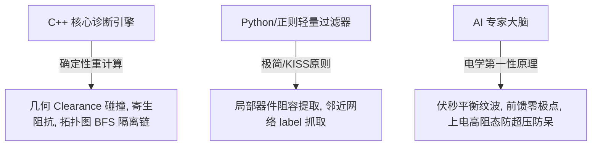

# 🛡️ KiCad-Auditor: 现代 C++20 强力驱动的智能硬件静态分析与 Layout 缺陷审计引擎

<p align="center">
  
  
  
  
</p>

`KiCad-Auditor` 是一款**高内聚、高吞吐、零第三方大库依赖**的 KiCad 智能印制电路板（PCB）与原理图（Schematic）静态分析与电磁合规审计工具。项目基于**现代 C++20** 标准构建，旨在将极致的计算机物理几何求解性能与先进的 **AI 智能体原生协同（Agent-Native Architecture）** 理念相结合，在打样和制造前阻断 100% 的低级电学设计风险。

---

## 🌟 核心特性 (Features)

* **🚀 极速零拷贝 S-Expression 解析器**：利用 C++20 `std::string_view` 滑动双指针完成递归下降解析，保证了超大 KiCad（几MB级）文本读取的微秒级高性能，拒绝笨重的第三方解析大库。
* **📐 高精度物理几何 Clearance 碰撞求解**：自主实现二维射线多边形包围与高精点线几何间距算法，动态计算高频开关节点（如 SW）到大面积敷铜（GND Zone）顶点的绝对几何距离。
* **⚡ 电磁交流耦合阻抗估算**：基于高频电磁边缘电容公式，以 30ns 开关边沿等效的 $11.6\text{ MHz}$ 频宽计算寄生交流阻抗，防范共模电流向地网的噪声注入。
* **🔌 图论拓扑 BFS 隔离失效搜索**：建立原理图全网邻接表，以隔离器件（光耦、变压器）次级侧引脚为起点进行 BFS 遍历，精准逆向回溯并诊断主从意外短路的物理通路。
* **🧠 智能自更新选型规格规则库 (`components_db.json`)**：与 AI 智能体协同，根据立创商城（LCSC）编号在后台增量爬取并自适应学习芯片极限耐压与最大电流，离线状态下亦可实现全自动的“耐压超限硬卡点物理拦截”。
* **💬 交互式“电路设计讨论”协同流**：除了输出整板 Batch 报告外，完美适配 AI 专属技能书（`SKILL.md`），支持在原理图画板、调运放阻容、配 Buck 电源时的秒级、极简、高精度局部技术研讨。

---

## ⚖️ 核心架构与工作分配 (Architecture)

项目采用**“硬核物理引擎” + “轻量过滤器” + “AI专家大脑”** 的分层设计模式，保证极佳的高内聚低耦合：



---

## 📁 项目目录结构 (Directory)

```text
kicad-auditor/
├── data/
│   └── components_db.json     # 动态自更新的元器件极限电学参数规则库
├── src/
│   ├── common/
│   │   ├── types.hpp          # 基础几何结构与电学数据类型定义
│   │   ├── sexpr.hpp/.cpp     # 高性能 S-Expr 语法解析器
│   │   ├── rule.hpp           # 插拔式规则纯虚抽象基类
│   │   ├── registry.hpp       # 诊断规则策略注册管理器
│   │   └── report.hpp/.cpp    # 美观的 Markdown 报告生成器
│   ├── sch/
│   │   ├── sch_analyzer.hpp/.cpp # 原理图静态安全诊断引擎
│   │   └── rules/             # 原理图电学与隔离审查规则 (SCH_ISO, SCH_FB)
│   ├── pcb/
│   │   ├── pcb_analyzer.hpp/.cpp # PCB 布局与电磁阻抗分析引擎
│   │   └── rules/             # PCB 高频间距与包地屏蔽审查规则 (PCB_CLEARANCE, PCB_EMI)
│   ├── main.cpp               # 命令行统一入口
│   └── test_sexpr.cpp         # 全自动单元测试套件 (包含 79 项 PASS 测试)
├── Makefile                   # 锁定 clang++ 20 的极简高性能编译配置文件
├── make.bat                   # Windows 下一键极速编译脚本
├── .gitignore                 # 保护性隔离 release 物理发布包的忽略配置
└── release/                   # 包含 exe、说明书及技能书的免编译绿色发布包
```

---

## 🛠️ 构建与编译 (Build)

### 环境要求
* 编译器：`clang++` (支持 C++20 及以上)
* 构建工具：`mingw32-make` 或 `make`

### 编译指令
在项目根目录下，执行以下命令完成 Clang 极速构建与全套单元测试校验：
```bash
# 使用一键编译批处理
.\make.bat

# 或者直接使用 Makefile 构建
mingw32-make
```
编译成功后，将在根目录下生成独立无依赖的二进制程序 `kicad-auditor.exe`，并自动通过全套 79 项几何碰撞与拓扑规则的单元测试。

---

## 🚀 命令行使用指南 (Usage CLI)

为了保证在任何机器和项目下即插即用，本工具的 Release 包被设计为支持**完全相对路径调用**。

### 1. 原理图静态安全诊断 (Sch Audit)
诊断隔离带击穿风险、FB反馈分压比例及阻抗范围、使能（EN）悬空超压隐患：
```bash
.\kicad-auditor\release\kicad-auditor.exe sch -i .\<your_schematic_file>.kicad_sch
```

### 2. PCB 物理几何与高频阻抗诊断 (PCB Audit)
单独诊断 PCB 的高频开关地 Clearance（寄生共模阻抗）、敏感信号（FB）侧向 3W 避让避开辐射源、以及底层屏蔽参考地的投影完整度：
```bash
.\kicad-auditor\release\kicad-auditor.exe pcb -i .\<your_pcb_file>.kicad_pcb
```

### 3. 一键联合诊断并输出精美彩色 Markdown 报告 (Combined Audit)
自动联合 PCB 与原理图进行交叉大范围 DRC，自动协同调用 `kicad-cli` 进行全板 Zone 刷新避让，并输出带彩色表情标记的精美分析报告：
```bash
.\kicad-auditor\release\kicad-auditor.exe run -i .\<your_pcb_file>.kicad_pcb -c 0.25 -o .\kicad-auditor\hardware_audit_report.md
```
* `-c <mm>`：指定大面积 GND 铺铜到高频段实体的碰撞安全 Clearance 阈值（默认 `0.2 mm`）。
* `-o <path>`：指定报告的输出相对路径。

---

## 🧠 AI 智能体“电路设计讨论协同模式”

在您的 AI 编码/智能体对话环境中引入发布包下的 **`SKILL.md`** 技能，即可原地唤醒您的“画板智囊”。

当您处于画原理图（调运放阻容、配 Buck 电源反馈）或 Layout 走线（包地、3W避让）的设计阶段，**直接在对话框中向 AI 提问，无需手动生成繁重报告**：

* *“我正在画这个运放闭环放大，输入匹配电阻 10k，反馈电容 1nF，这样会有高频滞后吗？”*
* *“我刚刚画好了 5V BUCK 的反馈，上偏是 100k，并了 100nF 的前馈电容可以吗？”*

AI 助手会瞬间在后台**自动静默拉起提取器精准抓取局部器件和网表拓扑**，并运用电源设计、信号完整性（SI）和电磁兼容（EMC）的第一性原理，为您输出最专业、数字化、拒绝盲猜的改板建议！
